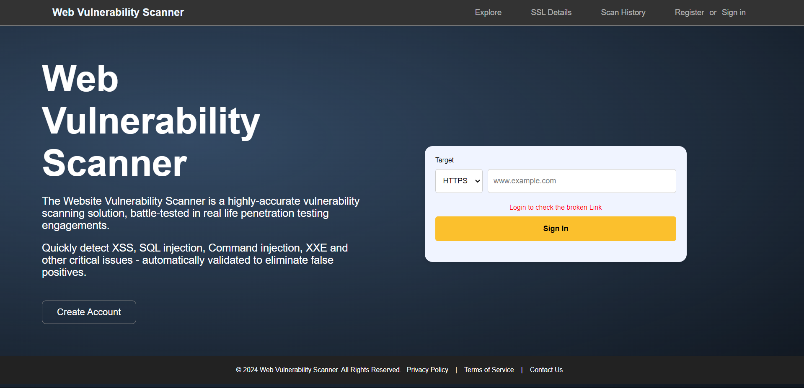
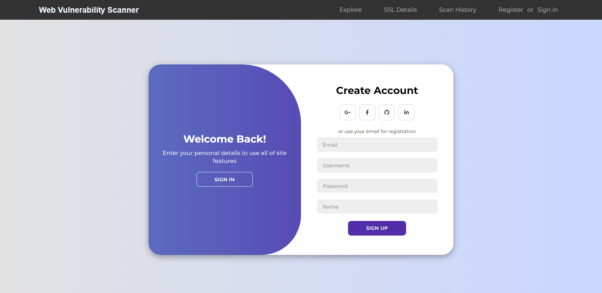
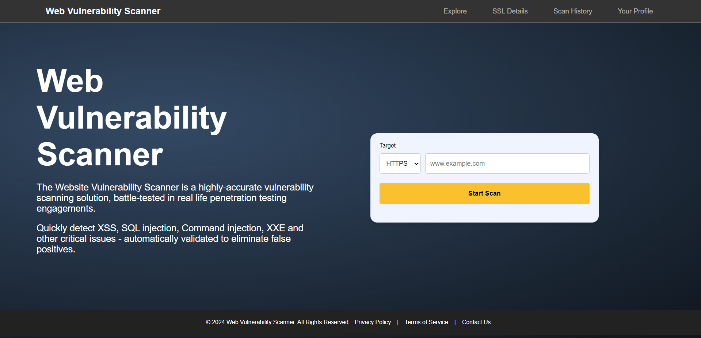
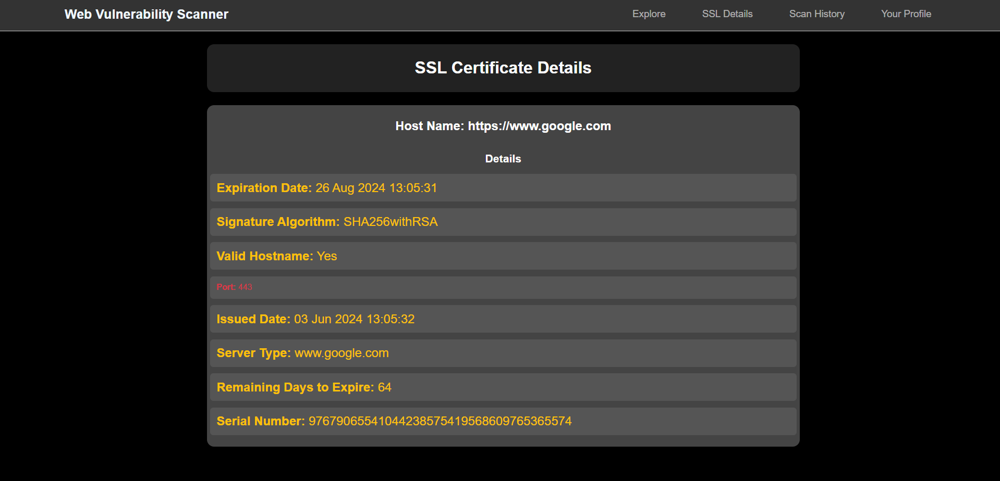

# WebGuard Analyzer

WebGuard Analyzer is a comprehensive web security analysis tool that allows users to upload links to check for URL vulnerabilities, monitor URL status in real-time, and verify SSL details. Built with Java, JSP, Servlet, and MySQL, this tool ensures robust and efficient web security management.

## Features

- **URL Vulnerability Check**: Scan URLs for potential security risks.
- **URL Status Monitoring**: Track the real-time status and availability of URLs.
- **SSL Details Verification**: Validate SSL certificates to ensure secure connections.

## Technologies Used

- **Java**: Core logic and functionality.
- **JSP and Servlets**: Dynamic web content and server-side processing.
- **MySQL**: Database for storing URL data and scan results.

## Screenshots

### Home Page


### Sign Up


### URL Search


### URL Analysis Details


### SSL Search


### SSL Details


### Profile


## Installation

1. **Clone the repository:**
    ```bash
    git clone https://github.com/sajalsantra/Web-Vulnerability-Check.git
    cd Web-Vulnerability-Check
    ```

2. **Set up the MySQL database:**
    - Create a new MySQL database.
    - Execute the SQL script in the `database` directory to create the necessary tables.

3. **Configure the database connection:**
    - Edit the `db.properties` file with your MySQL database credentials.

4. **Build and deploy the project:**
    - Use your preferred IDE (e.g., Eclipse, IntelliJ) to build the project.
    - Deploy the project on a servlet container (e.g., Apache Tomcat).

## Usage

1. **Upload a link:**
    - Navigate to the upload page.
    - Enter the URL you wish to analyze.
    - Submit the form to start the analysis.

2. **View results:**
    - Check the URL vulnerabilities, status, and SSL details on the results page.

## Contributing

We welcome contributions to enhance WebGuard Analyzer. Please follow these steps to contribute:

1. Fork the repository.
2. Create a new branch (`git checkout -b feature-branch`).
3. Make your changes and commit them (`git commit -m 'Add new feature'`).
4. Push to the branch (`git push origin feature-branch`).
5. Open a Pull Request.

## License

This project is licensed under the MIT License. See the `LICENSE` file for details.

## Contact

For any questions or feedback, please contact [your email address].

---

Feel free to customize this README file as needed for your specific project. Make sure to replace placeholders (like `your-username` and `your email address`) with your actual information.
